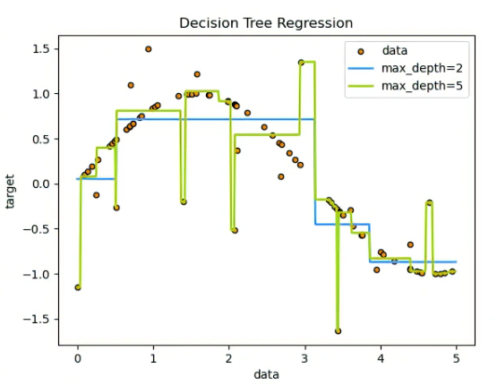

# Supervised Learning algorithm

## Logistic Regression
Logistic regresssion is selected when the dependent variable is categorical, meaning they have binary outputs, such as "true" and "false" or "tes" and "no".logistic regressionis mainily used to solve binary classification problem, such as spam identification.

## K-Nearest Neighbors(K-NN)
It is a non parametric algorithm that classifies data points based on their proximity and association to other available data. This assumes thatsimilar data points can be found near each other.

## Support Vector Machine(SVM)
It is a popular supervised learning model developed by Vladimir Vapnik, used for both data classification and regression.. That said, it is typically leveraged for classification problems, constructing a hyperplane(known as decision boundry) where the distance between two classes of data points is at its maximum. like oranges vs apples on either side of plane.

## Kernel SVM
SVM algorithm use a set of mathematical functioon that are defined as the kernel.The function of kernel is to take data as input and transform it into the required form. Different SVM algorithm use different types of kernel functions.These function can be different types. For example linear, nonlinear, polynomial, radial,radial basis function (RBF), and sigmoid.

## Naive Bayes
Naive Bayes is classification approach that adopts the principal of class conditional independence from Bayes Theorm, This means that the presence of one feature does not impact the pressence of another in the probability of a given outcome, and each predictor has an equal effect on that result, there are three types of Naive Bayes.
- Multinomial Naive Bayes
- Bernoulli Naive Bayes
- Gaussian Naive Bayes\
**NOTE: This technique is text classification, spam identification and recommendation systems. 

## Decision Tree Classification
These are non-parametric supervised learning method used for classification and regression. The goal is to create a model that predicts the value of a target variable by learning simple decision rules inferred from data features. A tree can be seen as a piece-wise constant approximation. see the picture below. 
For more information click here [link](https://scikit-learn.org/stable/modules/tree.html#classification)

## Random Forest Classification
Random forest is another flexible supervised machine learning algorithm used for both classification and regression purposes. The "forest" refrences a collection uncorrelated dicision trees, which are then merged together to reduce variance and create more accurate data predictions

# Un-Super Learning Algorithm
- K-mean Clustering
- Hierarchical Clustering
- Probabalistics

# 3. Semisupervised
- Mixture on 1 and 2
- Some data is labelled most is not

Some labelled data and some Unlabelled data\
Input data (30-70%) -->Training model and learnig pattern of data (Clustring)--> Prediction--> Output and reports

# Reinforcement Learning Algorithm
- Model Free Reinforcement Learning
  - Policy Optimization
  - Q-Learning
- Model-Based Reinforcement Learning
  - Learn the Model
  - Give the Model